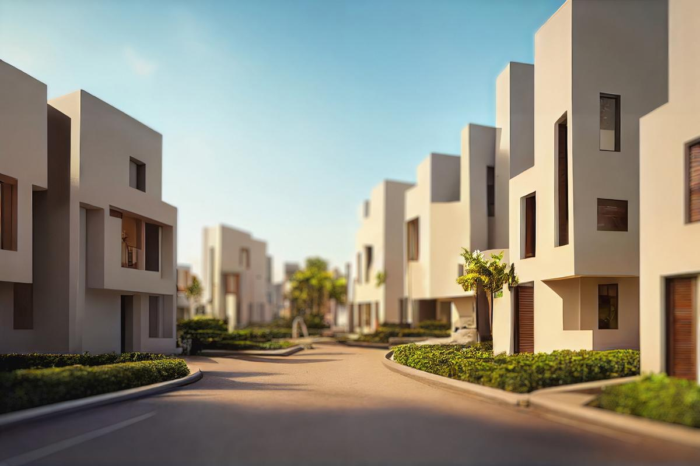
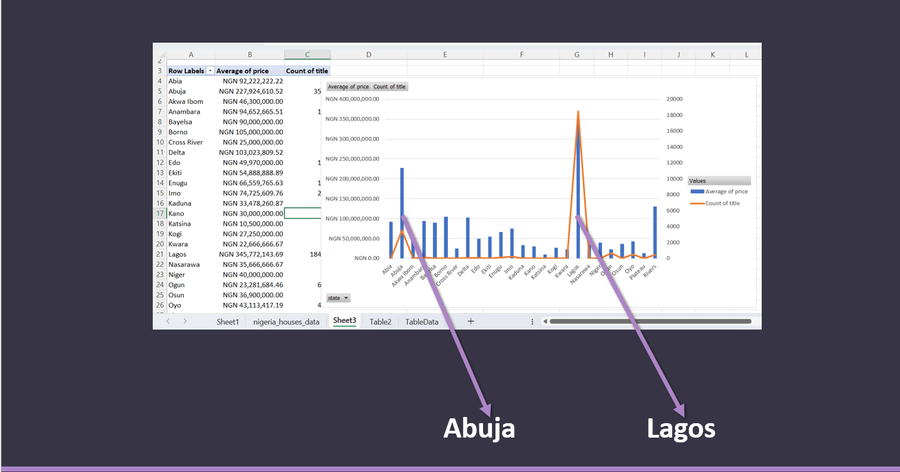

# Nigeria_Housing_Data

## Introduction
The Data file is a csv document listing states and the properties therein. The Dataset is not so comprehensive with detailing on states like Lagos and Abuja.

_**Disclaimer: This is beleved and treated like a dummy data, therefore inferences drawn are fictitious. Thank you**_

## Problem Statement
The question posed from the dataset includes: 
1. Overview exploratory examination of the dataset
2. To dertemine the average prices of housing per states, towns in Nigeria
3.To know states with low housing volume, pricing and standard of living.

## Skills Demonsrated
The following Excel concepts were demonstrated:
- Power Query
- Power Pivot
- Data Cleaning
- Calculated Fields
- Data Visualization

## Data Sourcing
The data was sourced from Kaggle and by extension Nigeria Property Centre.

## Modelling
No Modelling was done as the dataset consists of only one Table

## Analysis and Visualization
### Overview
The Nigerian Housing Data consist of eight (8) columns and a little above 24 thousand rows. This is a highly limited data source as Nigeria’s population stand at above 200 million individual, estimating the national average of 6 persons per home, there should be over 30 million records (rows). Furthermore, the descriptive characteristics are also limited without information such as square ft per home, urban-rural delineation and non capturing of all states within the country. 
This results in data skew especially in states like Lagos and Abuja, were there more focus.
Therefore, this data analysis should be taken as a sample analysis and not the real population picture. 

### States with at data counts of above 100 are listed above.
The average bedrooms in each state ranges between 3 and 4.5, while Lagos ranks highest for highest home prices with over 300 million naira per home.
The count of title in Lagos is above 15,000 while the next in line Abuja is not up to 5,000, because of this skew Lagos dwarf other state in all other comparison.

### Average Prices
Drilling down into towns, viewing average price, count of title, and amenities, we see an above title average prize in Guzape district, Maitama district and Ikoyi, which signifies reduced supply of properties which accounts for the high increase in average prices of houses in these towns. 
However, the opposite is true for Lekki, where there is a high supply of properties, and a corresponding low average price in comparison to the above towns.

### Low Count of Titles

Of the towns with low count of titles, Mowe, stands out with high count of titles. However, the average price reveals some insights, Epe and Kuje average prices are similar to that in Mowe, despite the high number of count titles in Mowe, a significance of high supply. Highest prices are seen in Aniocha South, Ibeju, Nasarawa and Ogijo.

### Poor Housing

A calculated field termed “Poor Housing” was created using a formula where the number bedrooms was higher than the toilets in the house. This is a field that can be used by government to identify, areas of poor sanitary system, and targets in periods of communicable diseases. The poor housing indices appeared in three (3) states, Cross River, Kano and Kastina. However, due to low data the details could not be drilled down for more specificity.

## Conclusion and Recommendation
Although the data was limited a few inferences were drawn, Houses in Ikoyi are the most expensive in Lagos state, other expensive houses were seen in Guzape, and Maitama in Abuja. Cross river, Kano and Kastina fall into the poor housing category therefore the govenrments in the respective states should work on legislation to improve standard housing construction.

**Thank You**
